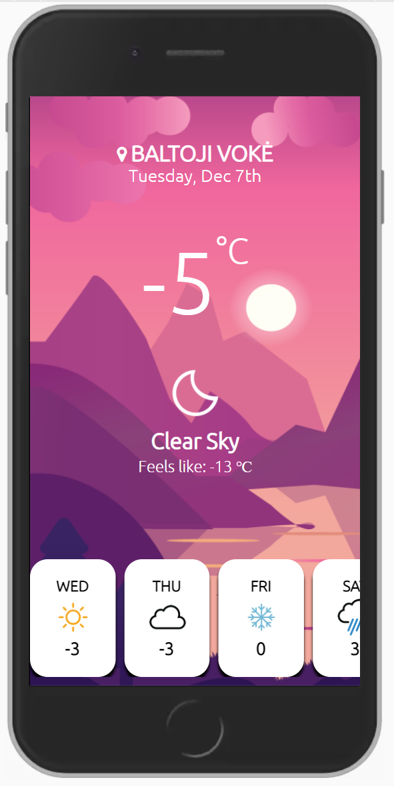

# Weather-app
Simple weather app for mobile devices with responsive design. For this project OpenWeather API was used.

## Features :
- Weather by Geolocation
- Current temperature
- Formatted date
- Responsive icons according to weather conditions (Clear sky, Rain etc.)
- Changing background image according to day time (Night,Morning,Day,Evening)
- Weather forecast for 7 upcoming days

